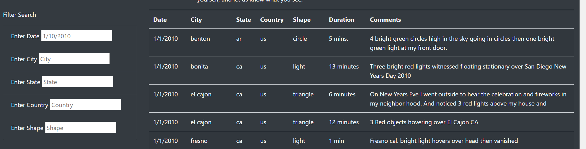

# UFOs Website Project

## Overview of Project
The purpose of this project was to utilize the data that Dana has regarding UFO encounters, and make a website to more easily and interactively view the data in different ways by creating filters to help narrow down one's focus. Ultimately, we created filters by date as well as multiple location-based filters like country, state, and city to read up on UFO encounters.


## Results of Project
The UFO website project resulted in the creation of filterable UFO encounter data on an interactive and visually pleasing website.

Depending on what one would like to search, be it date, city, state, etc., someone can easily input the desired search criteria into the box in order to filter through the table data on UFO encounters. It's a very simple setup, as you can see below, that allows free text entry into the search box filters.

View of website filters:

  

---

## Summary of Project
* One drawback of this website design is that user error can impact the table search, leading to a frustrating experience if one is misspelling a city or has the wrong date in mind making them unable to find a specific encounter.

* Two recommendations for future development would be to standardize the date input area so that a user couldn't use the wrong formatting and prevent search results from showing up. Additionally, creating a visual filtering system like a map that one can click into to zero in on encounters would make the website even more interactive and user friendly, as clicking is simpler than text input, especially when one is using their phone.


```bash
Kyle Schneider, 11/15/2020
```
